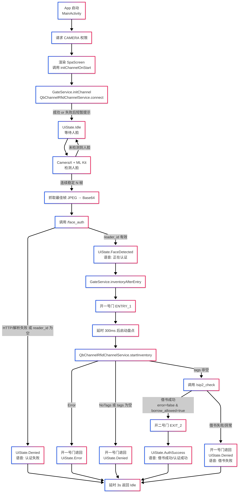

# 无感通道应用   
# Seamless Passage Application（SPA）  


## 原始项目地址
### https://github.com/kzeng/spa

## Releases
### https://github.com/kzeng/spa/releases


## 运行流程（工作流）


## UI原型


## UI原型详细描述
详细的 UI 原型说明请参见 [docs/UI.md](./docs/UI.md)。


## 开发环境与依赖
- JDK：17（项目使用 Java 17 兼容）
- Android Gradle Plugin（AGP）：8.2.2（见根级 `build.gradle.kts`）
- Kotlin：1.9.23（见根级 `build.gradle.kts`）
- 编译/目标 SDK：compileSdk 34，targetSdk 34；minSdk 23（见模块 `app/build.gradle.kts`）
- Compose：BOM `2024.02.01`，Compiler Extension `1.5.11`
- CameraX：`1.3.3`
- ML Kit 人脸检测：`com.google.mlkit:face-detection:16.1.5`
- 包名：`com.seamlesspassage.spa`（见 `namespace` 与 `applicationId`）

提示：建议使用支持 AGP 8.2 的 Android Studio 稳定版。项目已包含 Gradle Wrapper（Windows 使用 `gradlew.bat`）。

## 目录结构

- **应用模块**：`app/`
	- **清单与资源**：
		- `app/src/main/AndroidManifest.xml`
		- `app/src/main/res/values/strings.xml`
	- **入口与界面**：
		- `app/src/main/java/com/seamlesspassage/spa/MainActivity.kt`
		- `app/src/main/java/com/seamlesspassage/spa/ui/AppViewModel.kt`
		- `app/src/main/java/com/seamlesspassage/spa/ui/state/UiState.kt`
		- `app/src/main/java/com/seamlesspassage/spa/ui/components/`（自定义 UI 组件）
	- **相机与检测**：
		- `app/src/main/java/com/seamlesspassage/spa/camera/CameraPreview.kt`（CameraX + ML Kit）
	- **语音播报**：
		- `app/src/main/java/com/seamlesspassage/spa/speech/AudioPromptManager.kt`
	- **模拟服务**：
		- `app/src/main/java/com/seamlesspassage/spa/services/FaceAuthService.kt`
		- `app/src/main/java/com/seamlesspassage/spa/services/Sip2Service.kt`
		- `app/src/main/java/com/seamlesspassage/spa/services/GateService.kt`
- **文档**：
	- `docs/API.md`    **需要对齐的接口，重要!!！**
	- `docs/Flow.png`  **业务流程，重要！!!**
	- `docs/TODO.md`   **调试和实施前必看，重要！!!**
    - `docs/CMD.md`    常用命令
	- `spa_proto.jpeg` UI原型图


## 构建与运行
### Android Studio
1) 打开工程根目录，自动使用 Gradle Wrapper 同步依赖。
2) 选择目标设备（建议真机，前置相机可用）。
3) 运行 `app`（Debug）。

### 命令行（Windows）
```bat
gradlew.bat assembleDebug
gradlew.bat installDebug
```


## 兼容性
- Android 6.0（API 23）及以上；建议使用 Android 13/14 设备（targetSdk 34）。

