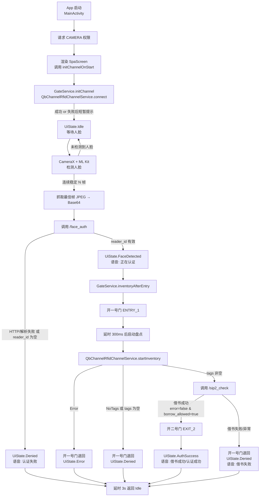

# SPA 无感通道业务流程与架构梳理

> 本文梳理当前代码实现下的整体业务流程、模块关系，并给出一张可视化流程图，方便调试与实施落地。

---

## 一、整体架构分层

- UI 层（Compose 单页面）
  - MainActivity
  - SpaScreen（包含 Camera 预览、状态栏）
  - BottomStatusPanel 等组件
- 状态与业务编排
  - AppViewModel
  - UiState（Idle / FaceDetected / AuthSuccess / Denied / Error）
- 业务服务层
  - FaceAuthService：封装本地 HTTP 接口 `/face_auth`
  - Sip2Service：封装本地 HTTP 接口 `/sip2_check`
  - GateService：封装门禁与通道整体流程（开门、盘点）
- 厂家通道抽象与实现
  - RfidChannelService：通道抽象接口
  - QbChannelRfidChannelService：对接厂家 QB 通道库（anreaderlib.jar + so）
  - SimulatedRfidChannelService：模拟实现（无需硬件）
- 外部依赖
  - 本地 HTTP 服务：`http://127.0.0.1:8080`（face_auth / sip2_check）
  - 厂家 RFID 无感借书通道（串口 /dev/ttyS4）

---

## 二、核心业务闭环流程概览

> 关键路径：**人脸检测 → /face_auth → 一号门+盘点 → /sip2_check → 二号门 或 一号门退回 → 回到 Idle**

### 文本版流程（主 Happy Path + 失败分支）

1. App 启动
   - MainActivity.onCreate() 启动，申请 CAMERA 权限。
   - 权限通过后渲染 SpaScreen，并在首次进入时调用 `viewModel.initChannelOnStart()`。
2. 通道初始化
   - AppViewModel.initChannelOnStart() → GateService.initChannel() → QbChannelRfidChannelService.connect()
   - 成功：通道连接+初始化完成，UI 仍保持在 Idle；
   - 失败：UiState.Error("通道连接失败: ...") 短暂显示后回到 Idle。
3. Idle 等待人脸
   - UiState.Idle：底部提示“请正对摄像头，您无须操作，等待完成识别”，播放 idle 语音。
   - FrontCameraPreview 持续从前置摄像头获取帧，交给 ML Kit 做人脸检测与关键点计算。
4. 检测到人脸 & 抓取最佳帧
   - ML Kit 连续 N 帧检测到稳定的人脸后：
     - 输出人脸框 +关键点给 FaceOverlay 用于 UI 展示；
     - 选取一帧最佳图像 → 转成 JPEG → Base64 编码；
     - 回调 SpaScreen 的 `onFaceDetected(faceImageBase64)`。
5. 进入业务编排 onFaceDetected
   - SpaScreen → AppViewModel.onFaceDetected(faceImageBase64)：
     - 仅在 UiState.Idle / Error 时受理；
     - UiState 切换为 FaceDetected（“正在认证身份，请保持正对镜头”）。
6. 调用本地 HTTP 接口 `/face_auth`
   - FaceAuthService.authenticate(image_base64)：
     - POST `http://127.0.0.1:8080/face_auth`
     - 请求体：`{"image_base64": "<Base64>"}`
     - 响应：若 HTTP 成功且 JSON 中 `reader_id` 非空 → 视为认证成功；否则视为失败。
   - 结果分支：
     - 失败：UiState.Denied（“认证失败”），3 秒后回到 Idle；
     - 成功：拿到 `reader_id`，继续下一步通道与盘点流程。
7. 一号门开门 + 盘点图书
   - AppViewModel 调用 GateService.inventoryAfterEntry(readerId)：
     - 确保通道连接（必要时重连）。
     - 调用 QbChannelRfidChannelService.openDoor(ENTRY_1)：开一号门让读者进入通道。
     - 延时约 300ms 等读者进入后，调用 QbChannelRfidChannelService.startInventory(timeout=5s)：
       - 轮询厂商缓冲区，解析标签数据为 `RfidTag(epc, uid)` 列表。
   - 盘点结果分支：
     - InventoryResult.Success(tags) 且 tags 非空：认为“有书”，继续调用 `/sip2_check`；
     - InventoryResult.Success(tags) 且 tags 为空：认为“无书”，视为失败：
       - 再次开一号门（退回）；UiState.Denied；
     - InventoryResult.NoTags：同“无书”处理（开一号门退回 + Denied）；
     - InventoryResult.Error(message)：
       - 开一号门退回；UiState.Error(message)。
8. 调用本地 HTTP 接口 `/sip2_check`
   - 在 tags 非空时调用 Sip2Service.check(readerId, tags)：
     - POST `http://127.0.0.1:8080/sip2_check`
     - 请求体：`{"reader_id": "<readerId>", "tags": [["<epc1>","<uid1>"], ...]}`
     - 响应：
       - `error == false && borrow_allowed == true` → 认为“借书成功”；
       - 其他任何情况（error 为 true 或 borrow_allowed 为 false，或 HTTP/解析错误）→ 认为“借书失败”。
9. 二号门开门 / 一号门退回
   - 借书成功：
     - GateService.openExitDoor() → QbChannelRfidChannelService.openDoor(EXIT_2)：开二号门；
     - UiState.AuthSuccess(userId)（“认证成功，请通过”/“借书成功”），播放成功语音；
   - 借书失败：
     - GateService.openEntryDoor()：再次开一号门，引导读者退回；
     - UiState.Denied（“借书失败”），播放失败语音。
10. 自动回到 Idle
  - 无论成功/失败/错误，AppViewModel 最终都会延时约 3 秒，将 UiState 重置为 Idle，准备下一位读者。

从上述 1–10 步可以看到：**每一条分支路径最终都会回到 Idle 状态**，业务流程是闭环的。

---

## 三、可视化流程图（Mermaid）

> 可以直接在支持 Mermaid 的 Markdown 预览中查看，也可以拷贝到在线 Mermaid 编辑器。

---

## 四、厂家接口调用与本地 HTTP 数据格式对齐情况

### 1. 厂家通道接口调用合理性（QbChannelRfidChannelService）

- 串口连接：
  - 使用 `/dev/ttyS4` + 115200 波特率 + 8N1 格式，典型配置合理，但需要与实际硬件确认端口号是否一致。
- 初始化流程：
  - 按示例顺序调用：`RDR_Open` → `QBCHANNEL_CFG_TurnstileParam` → `QB_CHANNEL_Init`。
  - 仅读取标签，不写 EAS/AFI 等，参数偏保守、安全。
- 开门控制：
  - DoorId.ENTRY_1 → 发送 `QB_SetChannelState(1)`；
  - DoorId.EXIT_2 → 发送 `QB_SetChannelState(2)`；
  - 每次返回值非 0 都转换为失败，并在 UI 以 Error 形式提示。
  - 这部分“1/2 含义”需根据厂家文档与现场试验确认一次，以防门方向反了。
- 盘点逻辑：
  - 按厂家 API 轮询缓冲区 → 读取记录 → `QB_CHANNEL_ParseGettedData` → 解析 UID 与 user 区；
  - 将 user 区按十六进制视为 EPC，UID 视为芯片 UID，形成 `tags: [[epc, uid], ...]`；
  - 在连接断开（特定错误码）时中止并返回 Error，避免死循环。

整体来看，厂家接口调用流程清晰，有基本的错误码处理和兜底逻辑；**需要现场重点验证的主要是：串口号、门号映射、EPC 字段长度与后端预期的对齐**。

### 2. 本地 HTTP 接口数据格式对齐情况

- `/face_auth`：
  - 请求：POST JSON `{ "image_base64": "<Base64>" }`；
  - 响应：读取 `reader_id` 字符串，非空即视为成功；
  - 与 API 文档完全一致，未使用其他字段。
- `/sip2_check`：
  - 请求：POST JSON
    - `reader_id`: 从 /face_auth 拿到的读者 ID；
    - `tags`: List<[epc, uid]>，其中 epc/uid 来自厂家数据解析；
  - 响应：
    - 读取 `error`（boolean）与 `borrow_allowed`（boolean），两者共同决定“借书成功/失败”；
    - `message` 仅用于日志/提示，不直接显示在当前 UI 上。
  - 结构与 API 文档匹配，没有字段名冲突。

因此，从 **前端实现和 API 文档角度看，本地 HTTP 数据格式是对齐的**；下一步是与后端一起用真实报文互测，确认 EPC 长度和取值范围完全匹配库系统要求。

---

## 五、调试与实施重点关注点（摘要）

> 详细的“上线检查清单”在 TODO.md 中有更细致条目，这里只列关键维度。

1. 本地 HTTP 服务
   - `/face_auth` 与 `/sip2_check` 是否都在 `127.0.0.1:8080` 正常监听；
   - 实际返回 JSON 是否包含文档约定的字段与含义（reader_id / error / borrow_allowed / message）。
2. 厂家通道与门控制
   - 串口号 `/dev/ttyS4` 与波特率是否和现场设备一致；
   - `QB_SetChannelState(1/2)` 是否真对应“一号门进 / 二号门出”；
   - 盘点结果中 EPC/UID 是否符合后端定义（尤其 EPC 长度 32 字节 / 64 个十六进制字符）。
3. 业务闭环与 UI 表达
   - 每种异常（HTTP 失败、通道连接失败、盘点错误）是否在 UI 底部有清晰文案，且都能在 3 秒内回到 Idle；
   - 成功/失败场景下语音提示与门的动作是否一致（“借书成功”→开二号门，“借书失败/认证失败”→开一号门或不开门）。
4. 日志与排错
   - 必要情况下，可在本地为 HTTP 请求/响应、厂家错误码增加日志输出，辅助定位接口/硬件问题；
   - 上线初期建议保留较详细日志，以便快速迭代调优。

如需，我可以再根据现场调试情况，进一步细化某些分支（例如面向后端同事的“HTTP 报文样例 + 说明”）。
